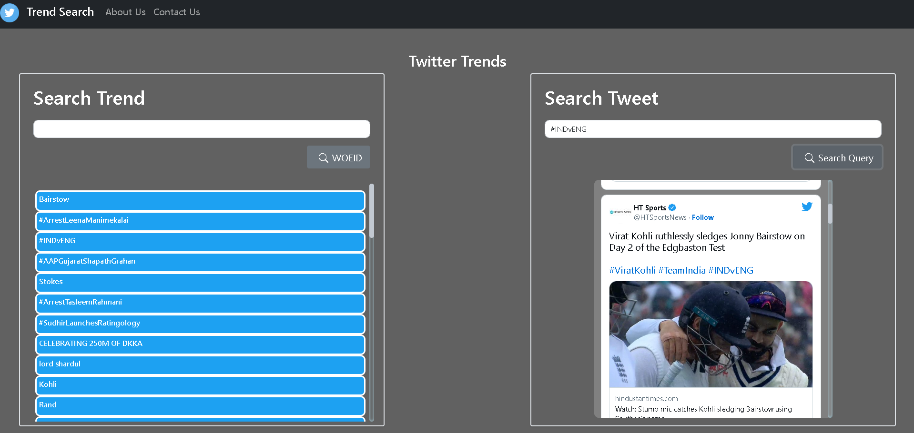

## **Trend-Search**

An Application built on twitter-api that gets tweets based on search results and latest trends of any particular region around the world based on WOEID, demonstartes how to use twitter-api for developers wanting to integrate it into their web applications.
---
## Technology Stack used:
  
```
  Backend -- Node,Express
  Frontend -- React,Bootstrap
```
 Main Page
 

 
 
## Installation Procedure:

#### Download the repository. Structure of the repository is shown below:

```
Trend-Search-Twitter-Application
   |-- Backend 
   |-- Frontend
```

---

#### **Run the backend :**

#### 1. Go to backend directory and install dependencies

```
cd backend

npm install

```

#### 2. Run the server

```
npm start
```

#### **Run the frontend:**

#### 1. Go to frontend directory and install dependencies

```
cd Frontend

npm install

```

#### 2. Run the server

```
npm start
```

Frontend will be live at http://localhost:3000/

Backend will be live at http://localhost:8000/

